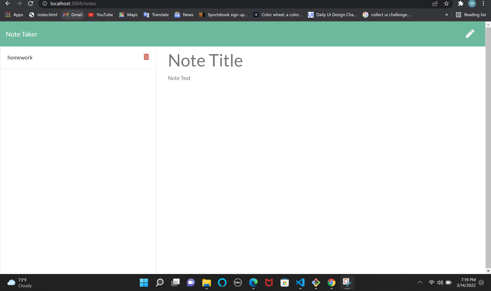

# Note Taker Project

## Table of Contents
- [Description](#description)
- [Installation](#installation)
- [Usage](#usage)
- [Contribution](#contribution)
- [Testing](#testing)
- [Screenshot](#screenshot)

## Description:
Project based on creating a note-taker app using express.js module.

## Installation:
We are going to used npm init in the terminal  to install all the packages needed, and then we are going to install the dependencies by using npm install and the name.

## Usage:
We used the project by cloning the repo and and start the project by using the terminal and typing node index.js.

## License:
This license is public used you can find it on:
https://opensource.org/licenses/MIT

## Contribution:
Yes you can contribute to the project by sending me  an email.

## Testing:
You can test the project by cloning the repository , and the next step your going to go the terminal and type node server.js or npm start to run the app

## Screenshot:

#### Heroku [App](https://note-app-taker1.herokuapp.com/)

## Contact Information:
- Github: https://github.com/wilmerojeda13.
- Email: ojedawilmerantonio@gmail.com. 